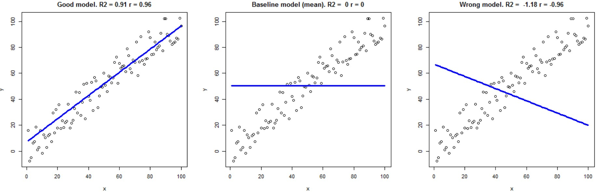

# PyEarth: A Python Introduction to Earth Science
## Lecture 4: Scikit-learn: Supervised Learning: Regression

---

# What is Linear Regression?

- A statistical method to model the relationship between variables
- Predicts a dependent variable based on one or more independent variables
- Assumes a linear relationship between variables


---

## Examples: CO2 Concentration


---

## Global Temperature Anomalies


---

## Arctic Sea Ice Extent


---

## Sea Level Rise


---

- How to quantify the relationship between variables?
- How to predict future values and interpret the results?
- How to use Python libraries to model and analyze data?


---

# Basic Statistics: Mean and Standard Deviation

- **Mean**: Average of a set of numbers 
$$\bar{x} = \frac{1}{n} \sum_{i=1}^{n} x_i$$

- **Standard Deviation**: Measure of spread in a dataset
$$\sigma = \sqrt{\frac{1}{n} \sum_{i=1}^{n} (x_i - \bar{x})^2}$$


---

# Linear Regression


$$y = Ax + b + \epsilon$$

- $y$: Dependent variable
- $x$: Independent variable
- $A$: Slope
- $b$: Intercept
- $\epsilon$: Error term


---

# Earthquake Example: 2019 Ridgecrest Earthquakes

- July 4, 2019: M6.4 earthquake
- July 5, 2019: M7.1 earthquake
- Location: Ridgecrest, California, USA

Link: [WIKI](https://en.wikipedia.org/wiki/2019_Ridgecrest_earthquakes)


---

## Ground Motion Data

Earthquake information: [USGS](https://earthquake.usgs.gov/earthquakes/eventpage/ci38443183/executive)
ShakeMap: [PGA](https://earthquake.usgs.gov/earthquakes/eventpage/ci38443183/shakemap/pga)


---

# Accessing Peak Ground Acceleration (PGA) Data

```python
import json
import pandas as pd
import numpy as np
import fsspec

# M6.4 earthquake
json_url = "https://earthquake.usgs.gov/product/shakemap/ci38443183/atlas/1594160017984/download/stationlist.json"
# M7.1 earthquake
# json_url = "https://earthquake.usgs.gov/product/shakemap/ci38457511/atlas/1594160054783/download/stationlist.json"

with fsspec.open(json_url) as f:
    data = json.load(f)

def parse_data(data):
    rows = []
    for line in data["features"]:
        rows.append({
            "station_id": line["id"],
            "longitude": line["geometry"]["coordinates"][0],
            "latitude": line["geometry"]["coordinates"][1],
            "pga": line["properties"]["pga"], # unit: %g
            "pgv": line["properties"]["pgv"], # unit: cm/s
            "distance": line["properties"]["distance"],
        }
    )
    return pd.DataFrame(rows)

data = parse_data(data)
data = data[(data["pga"] != "null") & (data["pgv"] != "null")]
data = data[~data["station_id"].str.startswith("DYFI")]
data = data.dropna()
data = data.sort_values(by="distance", ascending=True)
data["logR"] = data["distance"].apply(lambda x: np.log10(float(x)))
data["logPGA"] = data["pga"].apply(lambda x: np.log10(float(x)))
data["logPGV"] = data["pgv"].apply(lambda x: np.log10(float(x)))
data
```

---

# Visualizing Peak Ground Acceleration (PGA) Data

```python
import matplotlib.pyplot as plt
import cartopy.crs as ccrs
import cartopy.feature as cfeature

fig, ax = plt.subplots(figsize=(10, 6), subplot_kw={'projection': ccrs.PlateCarree()})

scatter = ax.scatter(data['longitude'], data['latitude'], c=data['pga'], 
                     cmap='viridis', transform=ccrs.PlateCarree())

ax.add_feature(cfeature.STATES)
ax.add_feature(cfeature.COASTLINE)
ax.set_extent([-120, -116, 34, 37], crs=ccrs.PlateCarree())

plt.colorbar(scatter, label='PGA %g')
plt.title('PGA Distribution - Ridgecrest Earthquake')
plt.show()
```

---

# Ground Motion Prediction Equations (GMPEs)

$$\log(PGA) = a \log(R) + bM + c$$

- PGA: Peak Ground Acceleration
- R: Distance from earthquake source
- M: Earthquake magnitude
- a, b, c: Model parameters

---

# Visualizing log(PGA) vs. log(R)

```python
plt.figure(figsize=(10, 6))
plt.scatter(data['logR'], data['logPGA'])
plt.xlabel('log(R)')
plt.ylabel('log(PGA)')
plt.title('log(PGA) vs. log(R)')
plt.show()
```

---

# Fitting a Linear Model using Scikit-learn

```python
from sklearn.linear_model import LinearRegression
from sklearn.model_selection import train_test_split

X = data[['logR']].values
y = data['logPGA'].values

X_train, X_test, y_train, y_test = train_test_split(X, y, test_size=0.2, random_state=42)

model = LinearRegression()
model.fit(X_train, y_train)

print(f"Slope (a): {model.coef_[0]:.4f}")
print(f"Intercept (b): {model.intercept_:.4f}")
```

---

# Visualizing the Linear Regression Model

```python
plt.figure(figsize=(10, 6))
plt.scatter(X, y, color='blue', label='Data')
plt.plot(X, model.predict(X), color='red', label='Regression Line')
plt.xlabel('log(Distance)')
plt.ylabel('log(PGA)')
plt.title('Linear Regression Model')
plt.legend()
plt.show()
```

---

# Interpreting the Results

- Slope (a): Represents the rate of decay of PGA with distance
- Intercept (b): Related to the earthquake's magnitude and local site conditions

Let's predict the shaking in Los Angeles:

```python
la_distance = 177  # km (approximate)
la_logR = np.log10(la_distance)
la_prediction = model.predict([[la_logR]])
print(f"Predicted log(PGA) in LA: {la_prediction[0]:.4f}")
print(f"Predicted PGA in LA: {10**la_prediction[0]:.4f} %g")
```

--- 

# Compare the prediction with the data

USGS PGA data: [USGS](https://earthquake.usgs.gov/earthquakes/eventpage/ci38443183/shakemap/pga)

- Why is the prediction different from the observed PGA in Los Angeles?

[M7.08 Ridgecrest Simulation](https://www.youtube.com/watch?app=desktop&v=DgN--agwu_8)


---

# Add the prediction to the plot

```python
plt.figure(figsize=(10, 6))
plt.scatter(X, y, color='blue', label='Data')
plt.plot(X, model.predict(X), color='red', label='Regression Line')
plt.scatter(la_logR, la_prediction, color='green', label='LA Prediction')
plt.xlabel('log(Distance)')
plt.ylabel('log(PGA)')
plt.title('Linear Regression Model with LA Prediction')
plt.legend()
plt.show()
```

---

# Residual Analysis

```python
y_pred = model.predict(X)
residuals = y - y_pred

plt.figure(figsize=(10, 6))
plt.scatter(X, residuals)
plt.xlabel('log(Distance)')
plt.ylabel('Residuals')
plt.title('Residual Plot')
plt.axhline(y=0, color='r', linestyle='--')
plt.show()
```

---

# Evaluating Model Quality: R-squared (R²)

- R² measures the proportion of variance in the dependent variable explained by the independent variable(s)
$$ R^2 = 1 - \frac{\sum (y_i - \hat{y}_i)^2}{\sum (y_i - \bar{y})^2} $$

- Ranges from 0 to 1, with 1 indicating a perfect fit

```python
from sklearn.metrics import r2_score

r2 = r2_score(y, y_pred)
print(f"R-squared: {r2:.4f}")

# Calculate R-squared manually
ss_res = np.sum((y - y_pred)**2)
ss_tot = np.sum((y - y.mean())**2)
r2_manual = 1 - ss_res / ss_tot
print(f"R-squared (manual): {r2_manual:.4f}")
```

---

# Understanding R²

- R² = 0: Model explains none of the variance in the dependent variable
- R² = 1: Model explains all the variance in the dependent variable
- R² < 0: Model performs worse than a horizontal line



---

# Parameter Uncertainty

- Standard error of the slope (a):

$$SE_a = \sqrt{\sigma^2 / \sum (x_i - \bar{x})^2}$$

where $\sigma^2 = \sum (y_i - \hat{y}_i)^2 / (n - p)$, $n$ is the number of observations, and $p$ is the number of predictors

- Standard error of the intercept (b):

$$SE_b = \sqrt{\sigma^2 (1/n + \bar{x}^2 / \sum (x_i - \bar{x})^2)}$$

---

# Calculating Parameter Uncertainty

```python
import numpy as np
from scipy import stats

n = len(X)
p = len(model.coef_) + 1
dof = n - p

sigma = np.sum((y - y_pred)**2) / dof

se_a = np.sqrt(sigma / np.sum((X - X.mean())**2))
se_b = np.sqrt(sigma * (1/n + (X.mean()**2) / np.sum((X - X.mean())**2)) )

print(f"Standard error of slope (a): {se_a:.4f}")
print(f"Standard error of intercept (b): {se_b:.4f}")
```

---

<!-- # Plotting Prediction Intervals

```python
from scipy import stats

t_value = stats.t.ppf(0.975, dof)
y_err = t_value * np.sqrt(mse * (1 + 1/n + (X - X.mean())**2 / np.sum((X - X.mean())**2)))

plt.figure(figsize=(10, 6))
plt.scatter(X, y, color='blue', label='Data')
plt.plot(X, y_pred, color='red', label='Regression Line')
plt.fill_between(X.flatten(), y_pred.flatten() - y_err.flatten(), y_pred.flatten() + y_err.flatten(), 
                 color='gray', alpha=0.2, label='95% confidence interval')
plt.xlabel('log(Distance)')
plt.ylabel('log(PGA)')
plt.title('Linear Regression with Prediction Intervals')
plt.legend()
plt.show()
```

--- -->

# Summary

- Linear regression is a powerful tool for modeling relationships in Earth Science data
- We applied it to model ground motion attenuation in earthquakes
- Important considerations:
  - Model assumptions
  - Residual analysis
  - Model evaluation (R²)
  - Parameter uncertainty
  - Prediction intervals


