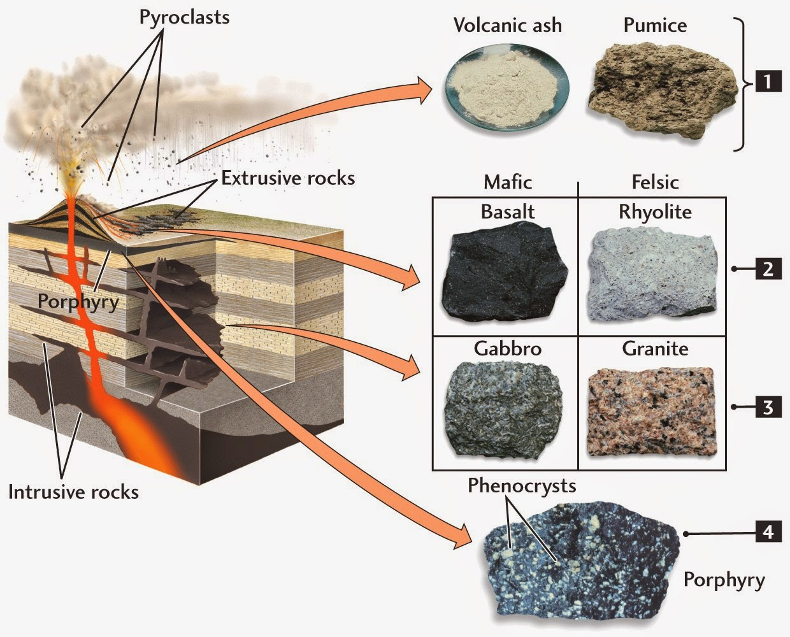
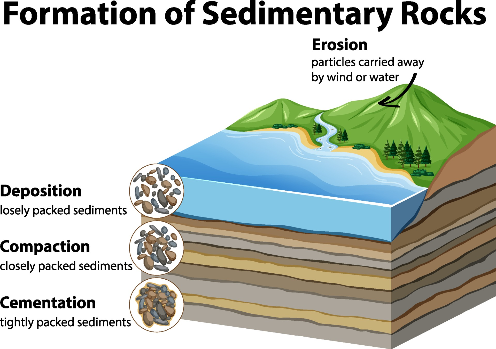
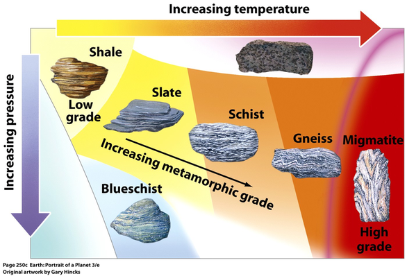

# PyEarth: A Python Introduction to Earth Science
## Unsupervised Learning: Clustering

---

# Major Rock Types on Earth

Earth's crust is composed of three main rock types:

1. Igneous Rocks
2. Sedimentary Rocks
3. Metamorphic Rocks


---

# Igneous Rocks

- Formed from cooled and solidified magma or lava
- Examples: Granite, Basalt, Obsidian



---

# Sedimentary Rocks

- Formed from the deposition and consolidation of sediments
- Examples: Sandstone, Limestone, Shale



---

# Metamorphic Rocks

- Formed from pre-existing rocks under high heat and pressure
- Examples: Marble, Gneiss, Slate



---


# An imaginary scenario as a geologist

Imagine you're a geologist who has collected rock samples from around the world. You've analyzed their chemical composition, but now you face a challenge:

**How do you organize these samples into different groups based on their chemical composition?**

---

# Exploring the Data

Let's look at our rock samples data:

```python
import pandas as pd
import matplotlib.pyplot as plt
import numpy as np
from IPython.display import display # pretty display of dataframes

# Load the data
data = pd.read_csv('data/rock_samples.csv')

# Display the first few rows
display(data.head())

# Randomly select two components to plot
components = np.random.choice(data.columns, 2, replace=False)

plt.figure(figsize=(10, 6))
plt.scatter(data[components[0]], data[components[1]])
plt.xlabel(components[0])
plt.ylabel(components[1])
plt.title(f'{components[0]} vs {components[1]}')
plt.show()
```

---

# The Need for Advanced Techniques

- Simple 2D plots don't reveal clear groupings
- We have multiple chemical components (high-dimensional data)
- We need techniques to:
  1. Reduce the dimensionality of our data
  2. Find natural groupings in our data

---

# Dimension Reduction

Why do we need dimension reduction?

1. Visualization of high-dimensional data
2. Noise reduction
3. Feature extraction
4. Computational efficiency

Common methods:
- Principal Component Analysis (PCA)
- t-SNE
- UMAP

---

# Principal Component Analysis (PCA)

PCA finds the directions (principal components) along which our data has the most variance.


---

# Applying PCA to Our Rock Samples

```python
from sklearn.decomposition import PCA
from sklearn.preprocessing import StandardScaler

# Standardize the data
scaler = StandardScaler()
data_scaled = scaler.fit_transform(data)

# Apply PCA
pca = PCA(n_components=2)
data_pca = pca.fit_transform(data_scaled)

# Plot the results
plt.figure(figsize=(10, 6))
plt.scatter(data_pca[:, 0], data_pca[:, 1])
plt.xlabel('First Principal Component')
plt.ylabel('Second Principal Component')
plt.title('PCA of Rock Samples')
plt.show()
```

---

# Interpreting PCA Results

- The first principal component captures the most variance in the data
- The second principal component captures the second most variance
- Each data point is represented by its coordinates along these components

**Can you see any groupings in the PCA plot? How many clusters do you think there are?**

---

# Clustering

Why do we need clustering?
- Discover patterns in data
- Identify natural groups
- Simplify data representation

Common clustering methods:
- K-Means
- DBSCAN
- Hierarchical Clustering

---

# K-Means Clustering

K-Means divides data into K clusters, each represented by its centroid.


---

# Applying K-Means to Rock Samples

```python
from sklearn.cluster import KMeans

# Standardize the data
scaler = StandardScaler()
data_scaled = scaler.fit_transform(data)

# Apply K-Means
kmeans = KMeans(n_clusters=3)
kmeans_labels = kmeans.fit_predict(data_scaled)

# Plot the results
plt.figure(figsize=(10, 6))
plt.scatter(data_pca[:, 0], data_pca[:, 1], c=kmeans_labels, cmap='viridis')
plt.xlabel('First Principal Component')
plt.ylabel('Second Principal Component')
plt.title('K-Means Clustering of Rock Samples')
plt.colorbar(label='Cluster')
plt.show()
```

---

# DBSCAN Clustering

DBSCAN (Density-Based Spatial Clustering of Applications with Noise) finds clusters based on the density of data points.


---

# Applying DBSCAN to Rock Samples

```python
from sklearn.cluster import DBSCAN

# Standardize the data
scaler = StandardScaler()
data_scaled = scaler.fit_transform(data)

# Apply DBSCAN
dbscan = DBSCAN(eps=1.5, min_samples=50)
dbscan_labels = dbscan.fit_predict(data_scaled)

# Plot the results
plt.figure(figsize=(10, 6))
plt.scatter(data_pca[:, 0], data_pca[:, 1], c=dbscan_labels, cmap='viridis')
plt.xlabel('First Principal Component')
plt.ylabel('Second Principal Component')
plt.title('DBSCAN Clustering of Rock Samples')
plt.colorbar(label='Cluster')
plt.show()
```

---

# Hierarchical Clustering

Hierarchical clustering builds a tree of clusters.


---

# Applying Hierarchical Clustering to Rock Samples

```python
from sklearn.cluster import AgglomerativeClustering

# Standardize the data
scaler = StandardScaler()
data_scaled = scaler.fit_transform(data)

# Apply Hierarchical Clustering
hierarchical = AgglomerativeClustering(n_clusters=3)
hierarchical_labels = hierarchical.fit_predict(data_scaled)

# Plot the results
plt.figure(figsize=(10, 6))
plt.scatter(data_pca[:, 0], data_pca[:, 1], c=hierarchical_labels, cmap='viridis')
plt.xlabel('First Principal Component')
plt.ylabel('Second Principal Component')
plt.title('Hierarchical Clustering of Rock Samples')
plt.colorbar(label='Cluster')
plt.show()
```

---

# Comparing with True Rock Types

```python
# Load true rock types
rock_types = pd.read_csv('data/rock_types.csv')

# Plot the results
plt.figure(figsize=(10, 6))
for rock_type in rock_types['rock_type'].unique():
    data_pca_type = data_pca[rock_types['rock_type'] == rock_type]
    plt.scatter(data_pca_type[:, 0], data_pca_type[:, 1], label=rock_type)
plt.xlabel('First Principal Component')
plt.ylabel('Second Principal Component')
plt.title('True Rock Types')
plt.legend()
plt.show()
```
Does your clustering method match the true rock types?

---

<!-- # Different Clustering Methods on Various Distributions -->


---

# Extra Exercise

1. Try different numbers of clusters for K-Means and Hierarchical Clustering.
2. Experiment with different `eps` and `min_samples` values for DBSCAN.
3. Apply clustering before and after PCA. How does PCA affect clustering results?
4. Apply PCA with different numbers of components and observe the effect on clustering.
5. For each distribution in the previous slide, which clustering method do you think works best? Why?

---

# Comparing Clustering Results With and Without PCA

```python
from sklearn.cluster import DBSCAN

# Standardize the data
scaler = StandardScaler()
data_scaled = scaler.fit_transform(data)

# Apply PCA
pca = PCA(n_components=2)
data_pca = pca.fit_transform(data_scaled)

# Apply DBSCAN
dbscan = DBSCAN(eps=0.5, min_samples=20)
dbscan_labels = dbscan.fit_predict(data_pca)

# Plot the results
plt.figure(figsize=(10, 6))
plt.scatter(data_pca[:, 0], data_pca[:, 1], c=dbscan_labels, cmap='viridis')
plt.xlabel('First Principal Component')
plt.ylabel('Second Principal Component')
plt.title('DBSCAN Clustering of Rock Samples')
plt.colorbar(label='Cluster')
plt.show()
```

---

# Conclusion

- Clustering is a powerful tool for grouping similar data points
- Different clustering methods work better for different data distributions
- Dimension reduction techniques like PCA can help visualize and sometimes improve clustering results
- Always consider the nature of your data when choosing a clustering method
